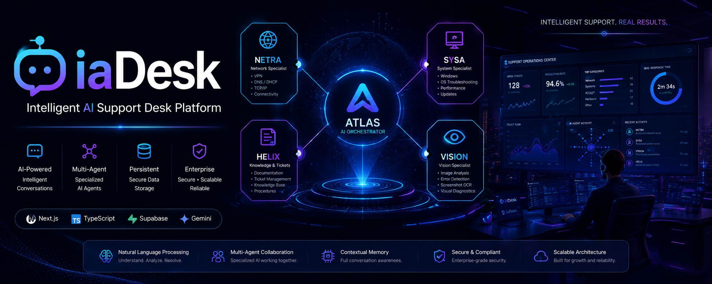

  

<h1 align="center">IaDesk</h1>

  Intelligent AI Support Desk Platform

# IaDesk 🧠💬  
Intelligent AI Support Desk System

O IaDesk é um sistema de suporte técnico inteligente baseado em IA, projetado para simular e automatizar um ambiente real de Service Desk corporativo.

O projeto evolui de um simples chat com IA para uma plataforma completa de atendimento técnico, com persistência de dados, memória contextual e arquitetura multiagente.

---

## 🚀 Visão do Projeto

O objetivo do IaDesk é criar um sistema capaz de:

- Interpretar chamados técnicos em linguagem natural
- Analisar problemas com IA (texto e imagem)
- Manter histórico completo de conversas
- Automatizar triagem de tickets
- Direcionar problemas para agentes especializados
- Simular um ambiente real de suporte corporativo

---

## 🧠 Arquitetura do Sistema

O sistema é dividido em camadas inteligentes:

### 🎯 Orquestrador (ATLAS)
Responsável por:
- Interpretar o contexto do usuário
- Classificar o tipo de problema
- Roteamento para agentes especializados

### 🧩 Agentes Especializados (futuro)
- NETRA → Redes, VPN, conectividade
- SYSA → Windows, sistemas operacionais
- HELIX → documentação e chamados
- VISION → análise de imagens e erros
- CORE → análise geral de suporte

### 🗄️ Camada de Dados
- Supabase (PostgreSQL)
- Persistência de conversas
- Histórico de mensagens
- Estrutura de chamados (tickets)

=======
# IaDesk 🧠💬  
Intelligent AI Support Desk System

O iaDesk é um sistema de suporte técnico inteligente baseado em IA, projetado para simular e automatizar um ambiente real de Service Desk corporativo.

O projeto evolui de um simples chat com IA para uma plataforma completa de atendimento técnico, com persistência de dados, memória contextual e arquitetura multiagente.

---

## 🚀 Visão do Projeto

O objetivo do IaDesk é criar um sistema capaz de:

- Interpretar chamados técnicos em linguagem natural
- Analisar problemas com IA (texto e imagem)
- Manter histórico completo de conversas
- Automatizar triagem de tickets
- Direcionar problemas para agentes especializados
- Simular um ambiente real de suporte corporativo

---

## 🧠 Arquitetura do Sistema

O sistema é dividido em camadas inteligentes:

### 🎯 Orquestrador (ATLAS)
Responsável por:
- Interpretar o contexto do usuário
- Classificar o tipo de problema
- Roteamento para agentes especializados

### 🧩 Agentes Especializados (futuro)
- NETRA → Redes, VPN, conectividade
- SYSA → Windows, sistemas operacionais
- HELIX → documentação e chamados
- VISION → análise de imagens e erros
- CORE → análise geral de suporte

### 🗄️ Camada de Dados
- Supabase (PostgreSQL)
- Persistência de conversas
- Histórico de mensagens
- Estrutura de chamados (tickets)

>>>>>>> 1f8d3c7b637249fa3438c8ee525aabbf8297ed44
### 💬 Camada de Interface
- Chat em tempo real
- Upload de imagens
- Histórico persistente
- Interface moderna (Next.js)

---

## ⚙️ Stack Tecnológica

- Next.js (App Router)
- TypeScript
- Supabase (PostgreSQL)
- Google Gemini API (`@google/genai`)
- React Hooks
- API Routes

---

## ✨ Funcionalidades atuais

- 💬 Chat com IA funcional
- 🧠 Integração com Gemini
- 🗂️ Criação automática de conversas
- 💾 Persistência de mensagens no Supabase
- 📎 Upload e análise de imagens
- 🔄 Histórico de conversa contínuo
- ⚙️ Estrutura preparada para multiagentes

---

## 🧭 Roadmap de evolução

### Fase 1 — Base do sistema
- Chat com IA funcional
- Interface inicial em Next.js

### Fase 2 — Persistência
- Integração com Supabase
- Histórico de conversas
- Criação automática de tickets

### Fase 3 — Inteligência contextual
- Memória de conversa
- Contexto contínuo para IA
- Melhor interpretação de problemas

### Fase 4 — Multiagentes 🤖
- ATLAS (orquestrador principal)
- Agentes especializados por domínio
- Comunicação entre agentes

### Fase 5 — Dashboard
- Painel de chamados
- Status de tickets
- Métricas de atendimento

### Fase 6 — Sistema corporativo completo
- Autenticação de usuários
- SLA de atendimento
- Simulação de service desk real

---

## 🎯 Objetivo final

Transformar o IaDesk em uma plataforma completa de suporte técnico inteligente, capaz de simular um ambiente real de TI corporativo com IA atuando como analista de suporte.

---

## 👨‍💻 Autor

Projeto desenvolvido como estudo avançado de:

- Inteligência Artificial aplicada
- Arquitetura de sistemas distribuídos
- Automação de suporte técnico
- Multiagentes e orquestração de IA
